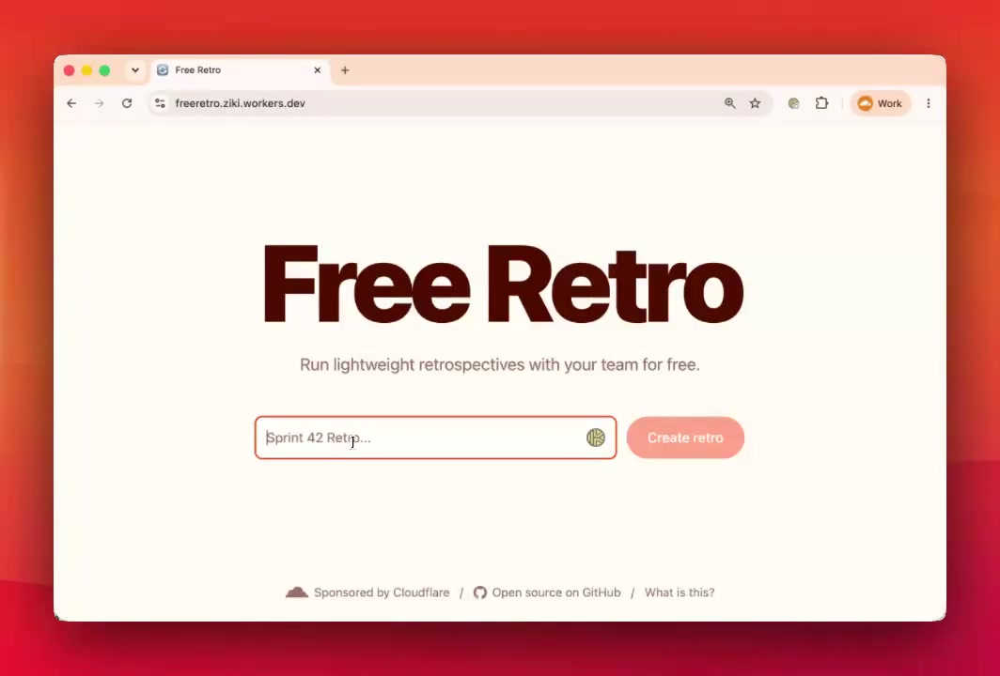

# Free Retro

Free Retro is a real-time retrospective board. Create an unlisted retro, share the link with your team, and delete it when you are done.

Built with 🧡 by Cloudflare.

## Demo

[](demo.mp4)

## Development

```sh
script/setup
script/dev
```

## Checks

```sh
script/lint
script/test
npm run typecheck
npm run build
```

## Deployment

This app runs on Cloudflare Workers with Durable Objects for real-time state. Deploy with:

```sh
script/deploy
```

CI deploys from `main` using the `CLOUDFLARE_ACCOUNT_ID` and `CLOUDFLARE_API_TOKEN` GitHub Actions secrets.

## Agent notes

See [AGENTS.md](./AGENTS.md) for project-specific instructions for coding agents.
